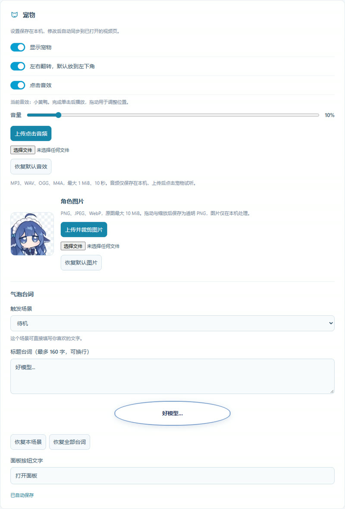

<p align="center">
  <a href="https://biliskipad.bakapiano.com/">
    
  </a>
</p>

<h1 align="center">BiliSkip</h1>

<p align="center">用 DeepSeek 识别 B站视频中的植入广告，在原生进度条上标记并按需跳过。</p>

<div align="center">

[](LICENSE)
[](https://greasyfork.org/zh-CN/scripts/597956-biliskip-ai-%E5%B9%BF%E5%91%8A%E8%B7%B3%E8%BF%87)

[](https://greasyfork.org/zh-CN/scripts/597956-biliskip-ai-%E5%B9%BF%E5%91%8A%E8%B7%B3%E8%BF%87)
[](https://biliskipad.bakapiano.com/)
[](https://biliskipad.bakapiano.com/)
[](https://biliskipad.bakapiano.com/)

[官网](https://biliskipad.bakapiano.com/) · [安装](#安装与使用) · [使用说明](docs/extension.md) · [更新日志](docs/releases/0.2.0.md) · [反馈问题](https://github.com/bakapiano/bilibili-skip-ad/issues)

</div>

直接复用线上共享标记，也可以填入自己的 DeepSeek API Key 识别新视频。
已有结果保存在本机，金色区间显示在 B站原生进度条上；自动跳过、边界试听与撤销都可以按需使用。

| 油猴脚本                                                                                                         | Chrome 扩展                                                                                  | ZIP / 源码                                                                                                                                     |
| ---------------------------------------------------------------------------------------------------------------- | -------------------------------------------------------------------------------------------- | ---------------------------------------------------------------------------------------------------------------------------------------------- |
| [Greasy Fork 安装](https://greasyfork.org/zh-CN/scripts/597956-biliskip-ai-%E5%B9%BF%E5%91%8A%E8%B7%B3%E8%BF%87) | [Chrome 应用商店](https://chromewebstore.google.com/detail/oebfplajlnbkabikbcadhhjhjdijahjk) | [下载 ZIP](https://biliskipad.bakapiano.com/downloads/biliskip.zip) · [校验值](https://biliskipad.bakapiano.com/downloads/biliskip.zip.sha256) |
| Tampermonkey 5.4+，适用于 Chrome / Edge                                                                          | 工具栏弹窗与独立设置页                                                                       | 解压后加载，或直接加载仓库的 `extension/`                                                                                                      |

当前源码：扩展 **0.2.0**，油猴 **0.2.0.1**。官网、商店和 Greasy Fork 按各自发布流程更新。

<details>
<summary>统计口径</summary>

- 油猴安装量来自 Greasy Fork 的公开累计安装次数，用于展示该分发渠道的使用规模。Chrome / Edge 的用户统计以对应商店为准。
- 缓存视频与片段来自本站共享数据库。每个视频分 P 取最新有效结果，零广告结果计入缓存视频数。
- 节省时间按这些广告片段的总时长汇总，每个分 P 计一次；这是缓存覆盖的广告时长。
- 徽章由 Shields.io 渲染，本站提供只读汇总接口，更新有数分钟缓存。

</details>

## 实际效果


查看 [官网实机展示](https://biliskipad.bakapiano.com/#screenshot-title)，或打开 [示例视频](https://www.bilibili.com/video/BV1Lmd2BAEad/) 体验共享缓存与跳过。

## 宠物：吃白饭，也干活

0.2 新增可选宠物，陪你用 DeepSeek 识别并自动跳过恰饭片段。打开设置的「宠物」分区即可开启，Chrome 扩展与油猴版共用这套交互。

<p align="center">
  
</p>

实机局部截图：复用共享标记，实际跳过后由宠物显示提醒。

- **状态提醒**：识别、完成与自动跳过时展示对应台词，完成后可查看本次参考费用；缓存命中时安静陪伴。
- **戳一戳**：点击会回弹、播放音效并显示待机台词；气泡内的插件 Logo 可打开操作面板。
- **放在顺手的位置**：支持拖动、左右镜像和贴底，气泡按可用空间展开。
- **换成自己的搭子**：本机上传并裁剪图片，自定义台词和点击音频；默认小黄鸭音效，音量为 10%。

<details>
<summary>查看完整播放器与宠物设置截图</summary>




</details>

适用于 **0.2 及以上版本**，各安装渠道的版本见对应发布页。详细配置见[宠物使用说明](docs/pet-preview.md)。
灵感参考 [DSH 的余额挂件](https://github.com/MeteorNOX/DeepSeek-Balance-Whale-Widget)，感谢原作者；角色与音效的独立素材声明见[来源说明](assets/pet/NOTICE.md)。

## 功能

- 从当前 B站视频读取带时间戳的字幕，按中文 → 英文 → 其他语言回退，通过 DeepSeek Flash 识别商业植入；面板显示实际字幕语言。
- 全部字幕轨道不可用时，可在浏览器本机转写音频，用于共享缓存匹配或授权后的DeepSeek分析。首次按需下载约239MB模型。
- 设置页可提前下载、取消下载或校验语音模型；可选本站、HF-Mirror和Hugging Face，统一校验同一份模型哈希并复用浏览器缓存。
- 原生进度条仅显示通过评分阈值和时长保护的金色广告区间；试听与撤销保留的片段隐藏标记。开启自动跳过后，播放或主动定位到广告时跳至末尾。
- 独立的短视频豁免区块：可调分钟数，支持小数；命中后跳过字幕、ASR、广告分析、缓存标记应用和广告跳过。
- 提供边界试听、手动跳过和撤销功能。
- 可选宠物提供分析与跳过提示，支持镜像贴边、自定义台词、图片裁剪与音频上传；在设置的「宠物」分区开启。
- 操作面板位于 Chrome 工具栏图标弹窗，视频页保留原生进度条标记；关闭弹窗后继续处理分析与播放。
- 支持侧边推荐视频及分 P 切换，按新视频身份更新标记。
- 按视频、字幕指纹、模型和提示词版本保存本地缓存。
- 默认连接 `biliskipad.bakapiano.com` 的线上共享缓存，新分析结果保存本地后自动上传；设置页可关闭自动上传，弹窗保留手动上传入口。

## 安装与使用

官网默认展示「油猴脚本」，也可切换到「Chrome 扩展」查看对应下载入口与安装步骤。两个版本请选择一个运行。

### 油猴版

1. 在浏览器安装 Tampermonkey 5.4+，按其提示完成脚本运行配置。
2. 打开 [BiliSkip 的 Greasy Fork 页面](https://greasyfork.org/zh-CN/scripts/597956-biliskip-ai-%E5%B9%BF%E5%91%8A%E8%B7%B3%E8%BF%87)，点击「安装此脚本」，再在油猴确认页完成安装。
3. 刷新 B站视频页，从油猴菜单打开「BiliSkip · 打开面板」。需要新识别时，配置个人 DeepSeek Key，并在设置里确认字幕发送授权。

源码安装：运行 `npm run build:userscript`，将 `dist/biliskip.user.js` 的完整内容粘贴到油猴新建脚本并保存。
操作面板按需打开，视频进度条持续显示广告标记。
两个版本各自保存本地数据，共用线上缓存；请选一个版本控制播放器。安装与代码共享说明见 [userscript/README.md](userscript/README.md)。

### Chrome 扩展

Chrome 商店版已上架：打开 [BiliSkip 的 Chrome 应用商店页面](https://chromewebstore.google.com/detail/oebfplajlnbkabikbcadhhjhjdijahjk)，点击「添加至 Chrome」并确认安装。

1. 在 Chrome 工具栏的扩展菜单中固定 BiliSkip。
2. 需要自行识别时，在扩展设置页配置个人 DeepSeek Key，并确认字幕发送授权；已有共享结果可先直接读取。
3. 打开 B站视频，点击 Chrome 工具栏的 BiliSkip 图标。已有缓存会直接显示；需要新识别时点击「分析当前视频」，试听广告边界后按需开启自动跳过。

商店安装版通过 Chrome 更新。油猴版、商店版和开发版各自保存个人设置与本地数据，请选择一个版本控制播放器；切换安装方式时重新配置设置，按需先导出广告标记。

#### ZIP / 源码安装

1. 下载上面的 ZIP 并解压到固定目录；也可以克隆本仓库。
2. 在 Chrome 打开 `chrome://extensions`，开启开发者模式。
3. 点击「加载已解压的扩展程序」：ZIP 用户选择包含 `manifest.json` 的解压目录，源码用户选择仓库中的 `extension/`。

运行环境为 Chrome 120+。通过已解压目录加载扩展时，运行代码可直接使用；Node.js 用于开发、测试、打包和自部署后端。

更新 ZIP / 源码版时保留原扩展目录，在扩展管理页重新加载，再刷新 B站视频页。关闭弹窗后，已开始的分析、上传和自动跳过继续运行。

## 默认设置

| 设置         | 首次使用默认值  | 作用                                               |
| ------------ | --------------- | -------------------------------------------------- |
| 自动分析     | 关闭            | 开启后，对前台视频中尚无缓存的内容自动发起识别     |
| 自动跳过     | 关闭            | 开启后跳过符合阈值的广告，默认自评分阈值为 `0.90`  |
| 宠物显示     | 关闭            | 在「宠物」分区开启，显示状态气泡并支持点击互动     |
| 本地转写     | 关闭，2路CPU    | 开启后无字幕时按需转写，可选1/2/4/6/8路并发        |
| 转写字幕上传 | 开启            | 新生成的本地转写字幕按独立开关上传，用于准确度评估 |
| 短视频豁免   | 关闭，预设3分钟 | 开启后严格按视频时长小于设定分钟数豁免             |
| 查询共享缓存 | 开启            | 本地未命中时查询内置线上服务                       |
| 允许上传     | 开启            | 自动上传和手动上传的总开关                         |
| 自动上传     | 开启            | 新分析结果保存本地后自动提交一次                   |

关闭「分析完成后自动上传到共享缓存」后，仍可在弹窗手动上传。原有的上传总开关关闭设置会继续生效。

### 可选的本地语音转写

全部字幕轨道不可用时，可以开启 SenseVoiceSmall INT8 本地转写。首次按需下载约239MB模型，在本机CPU运行，默认2路并发；设置页可提前下载并选择本站、HF-Mirror或Hugging Face，下载后统一校验SHA-256。

已开启本地转写时，空Key模式也可手动转写后匹配共享缓存。完整转写文本及时间戳的上传由独立开关控制，默认开启，音频在本机处理。详见 [ASR说明](docs/asr-trial.md)。

油猴0.1.9.1在WASM/VAD资源失效时暂停当前页面的新转写，字幕识别、缓存、标记和跳过继续运行；设置中可重新检查资源。共享服务异常时复用本地结果，上传失败保留已生成的标记。详见 [降级验收](docs/testing/userscript-fallback-0.1.9.1.md)。

### 当前识别版本

两端共用 `deepseek-flash` 和仅广告JSON v2提示词：输入标题与编号字幕，输出连续广告段落，再由客户端绑定时间戳。提示词经过固定1000条社区样本对照测试，详见 [0.1.9更新说明](docs/releases/0.1.9.md) 与 [评测报告](prompt/experiments/expanded-1000-json-v2-2026-10-02.md)。

`ad-cues-v6-json` 与旧提示词的缓存分别积累，已有Key、设置和记录保留。后端兼容v1–v6；设置页缓存列表提供10／20／50条分页。实验用Qwen模型继续保留在独立POC。

## 缓存和识别流程

1. 打开或切换视频时，核对 BV、分 P、CID 和时长，先检查短视频豁免，再按中文、英文、其他语言读取字幕；无字幕时按设置使用本地ASR字幕缓存或转写。
2. 以视频标识、字幕指纹、模型和提示词版本查询本地缓存，未命中时再查询共享缓存。弹窗中的「读取线上缓存」可以主动刷新线上结果。
3. 新分析使用个人 Key 直接请求 `deepseek-flash`。模型返回广告起止句编号，插件结合原始字幕时间轴校验并生成跳过区间。
4. 有效结果先保存本地，再按当前设置自动上传。**0 段广告同样是有效缓存结果**。上传失败时保留本地标记，并提示手动重试。

新分析由 DeepSeek 按个人 API 账户用量计费；缓存命中时复用已有结果。「重新分析（再次计费）」会发起新的模型请求。
字幕覆盖率、字幕质量和模型判断会影响准确度；自评分适合配合试听与撤销核对。

## 项目结构

```text
extension/           Chrome 扩展运行代码、页面和样式
  lib/               字幕、模型、缓存、校验及消息模块
  asr/               本地转写引擎、Worker池与随包JS/WASM资源
userscript/          油猴入口、GM 网络／存储适配与按需面板
tests/               扩展、共享服务、官网构建与工具链回归测试
scripts/             项目检查和打包工具
prompt/              Prompt评测代码、界面、测试及本机数据
docs/                使用说明、共享协议与商店发布说明
  testing/           扩展回归、E2E 与历史排查记录
server/              Node HTTP + SQLite 共享缓存后端
  site/              静态官网、隐私说明和公开截图
store/               商店文案、权限披露与审核材料
.tmp/                本机临时测试脚本和输出（Git 忽略）
dist/                打包产物（Git 忽略）
AGENTS.md            项目协作与代码格式规范
eslint.config.js     ESLint 环境和质量规则
.prettierrc.json     统一格式配置
```

## 开发

本地Prompt评测环境：`npm run prompt`（也可用`npm run lab`），打开 `http://127.0.0.1:43820/`。
代码、测试与使用说明集中在`prompt/`；支持平均IoU、正文误跳率、广告遗漏率及新旧批次逐视频回归对比。
有效字幕数据和运行记录保存在Git忽略的`prompt/data/`与`prompt/runs/`。详见 [使用说明](prompt/README.md) 与
[首轮现有prompt审计](docs/testing/prompt-lab-audit-2026-10-02.md)。

使用 Node.js 22.13+ 的 22.x 或 Node.js 24+。

```powershell
npm ci --ignore-scripts
npm run lint
npm run lint:fix
npm run format
npm run format:check
npm test
npm run verify
npm run pack
npm run pack:store
npm run build:userscript
```

- `lint` 检查全部项目 JavaScript，包括扩展、正式测试、开发工具及配置文件。
- `lint:fix` 自动修复可处理的 ESLint 问题，`format` 统一 JS、JSON、HTML、CSS 和 Markdown 排版。
- `verify` 顺序执行 ESLint、格式检查、扩展资源/CSP/凭据检查和正式回归测试。
- `pack` / `pack:store` 先运行 `verify`，再把 `extension/` 打包到 `dist/`，生成 ZIP 与 SHA-256 文件。后端和官网独立部署。
- `build:userscript` 将共享业务与油猴适配打包成单文件及 SHA-256；发布前运行 `verify`。
- 依赖、临时脚本、本地数据和生成产物按配置隔离于正式检查范围。

临时接口探测和人工浏览器验证脚本统一放入 `.tmp/`；长期回归用例保留在 `tests/`。
完整约定见 [AGENTS.md](AGENTS.md)。

## 数据与隐私

个人 Key 保存在本机扩展存储中，模型请求将当前视频标题和字幕发送给 DeepSeek。
ASR音频在本机CPU处理，转写字幕按相同授权发送给DeepSeek。语音模型默认由 `biliskipad.bakapiano.com` 提供，可在设置中选择HF-Mirror或Hugging Face；各源固定相同快照，下载后核对SHA-256并保存至浏览器CacheStorage。所选下载站点及其CDN接收必要网络连接信息，Chrome按需申请第三方源域名权限。Chrome的JS/WASM随包分发；油猴业务JS保留在脚本内，WASM及VAD数据由带SRI的`@resource`在安装/更新时预加载并存入油猴资源存储。
线上查询默认开启，发送视频标识、字幕指纹和模型版本；新分析结果默认自动上传视频信息、标记与有限证据，设置中可单独关闭自动上传。关闭「允许上传」总开关会同时关闭自动与手动上传。共享令牌按域名绑定，候选上传采用字段白名单。

每段上传最多包含 10 条证据句，每条最多 500 字符。DeepSeek Key、B站会话分别用于各自的认证链路。
共享服务记录来源 IP 与提交次数，计数保留最近 7 个 UTC 日期。完整说明见 [隐私页](https://biliskipad.bakapiano.com/privacy.html)。

## 自部署共享服务与官网

共享后端使用 Node 原生 HTTP 与 SQLite，运行时依赖 Node 标准库。执行：

```sh
npm run server
```

默认监听`127.0.0.1:8787`，数据保存在`data/shared-cache.sqlite`。提供健康检查、共享标记查询／提交，以及`POST /v1/transcripts`转写字幕收集接口。
同一来源 IP 两次提交放行至少间隔 1000ms；IPv6 按 `/64` 网段统计。

当前共享规则是结构校验合格的首条提交直接发布，同键相同内容幂等返回，差异内容返回 `409`；维护者可以撤销记录。
这套风控用于控制提交频率，标记准确性依赖识别结果与后续反馈。

官网位于 `server/site/`，使用静态 HTML/CSS，由 Nginx 托管；缓存 API 继续转发到 Node。
公开站点包含介绍页、隐私说明、真实视频截图，以及 Chrome 应用商店、Greasy Fork 和备用扩展 ZIP 入口。安装区通过原生单选控件和 CSS 切换对应步骤。

```powershell
# 核验、打包扩展，并构建、部署官网和共享服务
npm run deploy:server

# 仅构建官网；传入已生成的扩展 ZIP
npm run build:site -- dist/<扩展上传包>.zip
```

`deploy:server` 的 SSH 目标与目录使用本项目的部署配置。部署到自己的机器前，按 [部署说明](server/DEPLOYMENT.md) 调整配置。
部署脚本会逐文件核对扩展 ZIP、校验部署包哈希，保留独立版本和失败回滚路径。
服务配置、IP 限流、管理命令见 [后端说明](server/README.md)。

## 验证状态

`npm run verify` 覆盖字幕回退、提示词与输出校验、本地ASR、资源降级、缓存与上传、播放器行为、服务端限流、统计徽章、官网构建、油猴单文件模拟集成、许可证与文档链接。
真实 Chrome、线上接口与模拟测试的验收范围统一收录在 [文档索引](docs/README.md)。

## 文档

- [文档索引与回归 / E2E 记录](docs/README.md)
- [扩展安装、架构和开发说明](docs/extension.md)
- [油猴安装与代码共享说明](userscript/README.md)
- [共享缓存 API 协议](docs/shared-cache-api.md)
- [后端与官网部署说明](server/DEPLOYMENT.md)
- [Chrome 商店打包与材料](docs/chrome-web-store.md)
- [一分钟介绍视频稿](store/intro-video-script.md)

## 许可证

本项目源码采用 [MIT License](LICENSE)。油猴发布文件包含 `@license MIT` 和完整许可文本，Chrome 扩展包随附 `LICENSE`。
第三方项目、视频、截图与音频素材按各自的许可证或权利授权使用。

## 调研参考

- [小电视空降助手](https://github.com/hanydd/BilibiliSponsorBlock)：B站播放器交互、社区标记与项目展示。
- [bilijump-ai](https://github.com/qingmeng1/bilijump-ai)、[biliadskip](https://github.com/chemhunter/biliadskip)：广告识别与跳过方案。
- [bilibili-ai-subtitle](https://github.com/ccBilly-aipm/bilibili-ai-subtitle)：字幕获取与处理思路。

感谢这些项目的作者。欢迎提交 Issue、复现样本和 Pull Request；提交前请阅读 [项目协作规范](AGENTS.md)。
